# 📘 Computer Science Fundamentals — Complete Notes

> A structured, GitHub-ready reference covering computer systems, hardware/software, memory, CPU, programming languages, errors, problem-solving, algorithms, complexity analysis, pseudocode, and flowcharts.

---

## Table of Contents

1. [What is a System?](#1-what-is-a-system)
2. [What is a Computer?](#2-what-is-a-computer)
3. [How a Computer Works](#3-how-a-computer-works)
4. [Hardware vs Software](#4-hardware-vs-software)
5. [Memory — RAM, ROM, SSD, HDD](#5-memory--ram-rom-ssd-hdd)
6. [CPU (Central Processing Unit)](#6-cpu-central-processing-unit)
7. [Programming Languages: High, Low, Machine Level](#7-programming-languages-high-low-machine-level)
8. [Compiler, Interpreter, Assembler](#8-compiler-interpreter-assembler)
9. [What is a Program?](#9-what-is-a-program)
10. [Errors in Programming](#10-errors-in-programming)
11. [Representation of a Problem & Solution](#11-representation-of-a-problem--solution)
12. [What is an Algorithm?](#12-what-is-an-algorithm)
13. [Algorithm Examples — Variable Swapping](#13-algorithm-examples--variable-swapping)
14. [Time Complexity & Space Complexity](#14-time-complexity--space-complexity)
15. [Properties of an Algorithm](#15-properties-of-an-algorithm)
16. [Pseudocode](#16-pseudocode)
17. [Flowcharts](#17-flowcharts)
18. [Program vs Algorithm — Final Summary](#18-program-vs-algorithm--final-summary)

---

## 1. What is a System?

A **system** is a collection of interrelated components that work together to achieve a common goal. It takes an **input**, processes it, and produces an **output**.

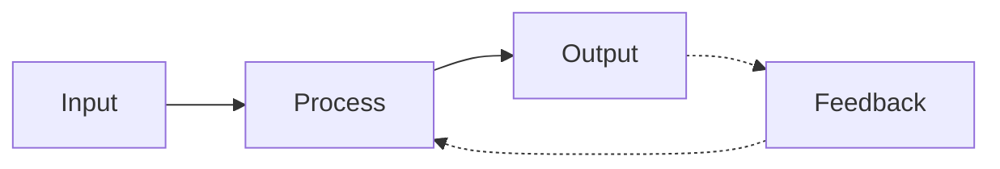

**Examples of systems:**
- A computer system (hardware + software working together)
- A digestive system (biological)
- A traffic control system

A **computer system** specifically refers to the combination of hardware, software, data, and users working together to process information.

---

## 2. What is a Computer?

A **computer** is an electronic device that accepts data (input), processes it according to a set of instructions (program), and produces meaningful results (output). It can store, retrieve, and process data at high speed.

> **Definition:** A computer is a programmable electronic device that performs arithmetic and logical operations automatically via a set of instructions called a program.

**Key characteristics:**

| Characteristic | Description |
|---|---|
| Speed | Performs billions of operations per second |
| Accuracy | Produces error-free results (if input/logic is correct) |
| Storage | Can store huge amounts of data |
| Automation | Executes instructions without human intervention once started |
| Versatility | Can perform diverse tasks — gaming, calculations, design, AI |
| Diligence | Never gets tired; consistent performance |

---

## 3. How a Computer Works

At its core, every computer follows the **Input → Process → Output → Storage (IPOS)** cycle.

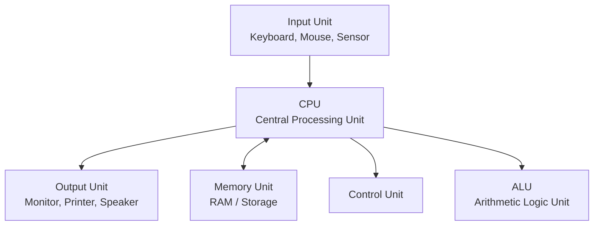

**Step-by-step working:**

1. **Input** — Data/instructions are entered via input devices (keyboard, mouse, sensors).
2. **Storage** — Data is temporarily stored in RAM for quick access.
3. **Processing** — CPU fetches instructions, decodes them, and executes them using the ALU and Control Unit.
4. **Output** — Processed results are displayed/delivered via output devices.
5. **Storage (permanent)** — Data can be saved permanently on HDD/SSD for future use.

This is often called the **Fetch–Decode–Execute Cycle**, the heartbeat of every CPU instruction.

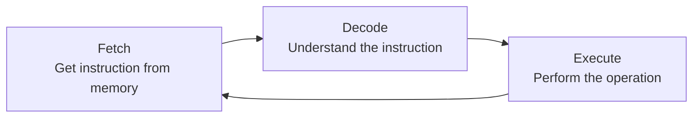

---

## 4. Hardware vs Software

| Aspect | Hardware | Software |
|---|---|---|
| Definition | Physical, tangible parts of a computer | Set of instructions/programs that run on hardware |
| Nature | Can be touched and seen | Cannot be touched, only experienced/used |
| Examples | CPU, RAM, Keyboard, Monitor, HDD | Windows OS, Chrome, VS Code, MS Word |
| Dependency | Works only when driven by software | Needs hardware to execute |
| Durability | Wears out physically over time | Doesn't wear out but can become outdated/buggy |
| Types | Input, Output, Storage, Processing devices | System Software, Application Software |

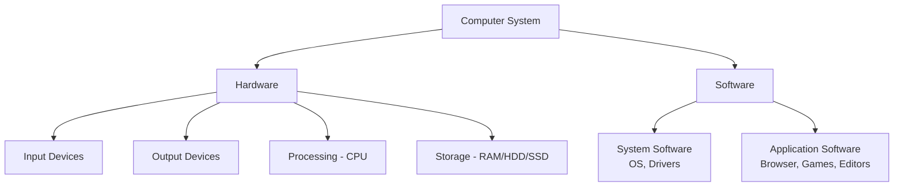

**Software is further divided into:**
- **System Software** — Manages hardware and provides platform for other software (e.g., Operating Systems, Device Drivers).
- **Application Software** — Performs specific user tasks (e.g., MS Excel, Photoshop, browsers).

---

## 5. Memory — RAM, ROM, SSD, HDD

Computer memory is broadly divided into **Primary Memory** (fast, temporary) and **Secondary Memory** (slower, permanent).

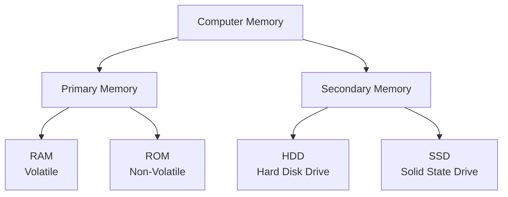

### 5.1 RAM (Random Access Memory)
- **Volatile** memory — data is lost when power is turned off.
- Used to store data/instructions **currently being processed** by the CPU.
- Much faster than secondary storage.
- More RAM = smoother multitasking.

### 5.2 ROM (Read Only Memory)
- **Non-volatile** — retains data even without power.
- Stores firmware/BIOS instructions needed to boot the computer.
- Generally not writable during normal operation.

### 5.3 HDD (Hard Disk Drive)
- Traditional secondary storage using **spinning magnetic platters** and a moving read/write head.
- Cheaper per GB, but slower and mechanically fragile.
- Good for bulk, long-term storage.

### 5.4 SSD (Solid State Drive)
- Modern secondary storage using **flash memory chips** (no moving parts).
- Much faster read/write speeds than HDD.
- More durable, silent, energy-efficient, but costlier per GB.

**Comparison Table:**

| Feature | RAM | ROM | HDD | SSD |
|---|---|---|---|---|
| Volatility | Volatile | Non-volatile | Non-volatile | Non-volatile |
| Speed | Very fast | Fast | Slow | Fast |
| Purpose | Temporary working memory | Store boot instructions | Permanent storage | Permanent storage |
| Writable | Yes | Usually no | Yes | Yes |
| Mechanical parts | No | No | Yes (moving disk/head) | No |
| Typical size | 4–64 GB | Few MB | 500 GB – few TB | 128 GB – few TB |
| Cost per GB | High | N/A | Low | Higher than HDD |

> 💡 **Analogy:** RAM is like a **desk** where you keep files you're actively working on (fast access, but cleared when you leave). HDD/SSD is like a **cabinet/almirah** where you store files permanently, even after leaving the room.

---

## 6. CPU (Central Processing Unit)

The **CPU** is the "brain" of the computer — it executes instructions from programs by performing arithmetic, logical, control, and input/output operations.

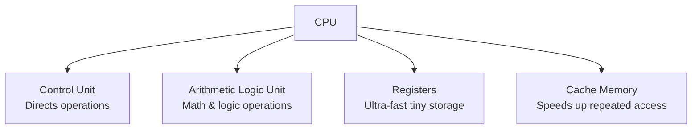

**Main components:**

| Component | Function |
|---|---|
| **Control Unit (CU)** | Directs the flow of data between CPU and other components; manages fetch-decode-execute cycle |
| **Arithmetic Logic Unit (ALU)** | Performs mathematical calculations (+, −, ×, ÷) and logical comparisons (<, >, =) |
| **Registers** | Extremely small, fast storage locations inside CPU for temporary data during execution |
| **Cache Memory** | Small high-speed memory that stores frequently used data close to the CPU |

**Key specs that affect CPU performance:**
- **Clock Speed (GHz)** — number of cycles per second
- **Cores** — number of independent processing units (multi-core = parallel processing)
- **Cache size** — how much frequently-used data can be kept close by

---

## 7. Programming Languages: High, Low, Machine Level

Programming languages are categorized by how close they are to human language vs. hardware instructions.

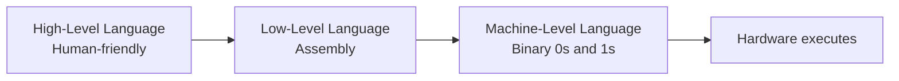

### 7.1 High-Level Language (HLL)
- Closer to **human language** (English-like syntax).
- Easy to write, read, debug, and maintain.
- **Platform-independent** (needs a compiler/interpreter to run on hardware).
- Examples: **Python, Java, C++, JavaScript, C#**

```python
# Example: High-level language (Python)
a = 5
b = 10
print(a + b)
```

### 7.2 Low-Level Language
- Closer to **hardware**; includes Assembly Language.
- Uses mnemonics (short codes like `MOV`, `ADD`, `SUB`) instead of pure binary.
- Requires an **Assembler** to convert to machine code.
- Faster and more memory-efficient but harder to write/debug.

```asm
; Example: Assembly language
MOV A, 5
ADD A, 10
```

### 7.3 Machine-Level Language
- The **only language the CPU directly understands** — pure binary (0s and 1s).
- Fastest execution, but extremely difficult for humans to read/write.
- Hardware-dependent (specific to CPU architecture).

```
Example: Machine code (binary)
10110000 00000101
```

**Comparison Table:**

| Feature | High-Level | Low-Level (Assembly) | Machine-Level |
|---|---|---|---|
| Human readability | Very high | Medium | Very low (binary) |
| Speed of execution | Slower | Fast | Fastest |
| Portability | Platform-independent | Platform-dependent | Fully hardware-specific |
| Translator needed | Compiler/Interpreter | Assembler | None (direct execution) |
| Example | Python, Java | Assembly (x86, ARM) | Binary 0/1 |
| Ease of debugging | Easiest | Moderate | Hardest |

---

## 8. Compiler, Interpreter, Assembler

These are **translator programs** that convert human-written code into machine-understandable instructions.

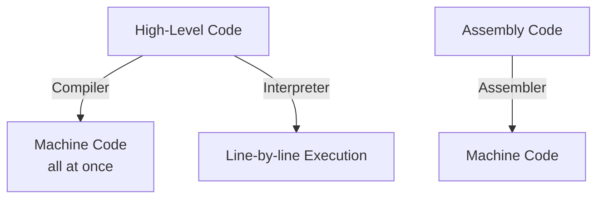

### 8.1 Compiler
- Translates the **entire source code** into machine code **at once**, before execution.
- Generates an executable file (e.g., `.exe`).
- Reports **all errors together** after full compilation.
- Faster execution once compiled.
- Examples: C, C++, Rust compilers (GCC, Clang)

### 8.2 Interpreter
- Translates and executes code **line-by-line**, on the fly.
- No separate executable is created.
- Stops at the **first error** encountered.
- Slower than compiled code but easier for debugging/scripting.
- Examples: Python, JavaScript (traditionally interpreted)

### 8.3 Assembler
- Converts **Assembly language** (low-level, mnemonic-based) into **machine code**.
- One-to-one (roughly) translation between assembly instructions and machine instructions.

**Comparison Table:**

| Feature | Compiler | Interpreter | Assembler |
|---|---|---|---|
| Input | High-level code | High-level code | Assembly code |
| Translation style | Whole program at once | Line-by-line | Whole program (mnemonic → binary) |
| Output | Executable machine code file | Direct execution, no file | Machine code |
| Error detection | After full compilation | Stops at first error | After full assembly |
| Speed | Faster execution | Slower execution | Fast |
| Examples | GCC (C/C++), javac (Java) | Python, older JS engines | NASM, MASM |

---

## 9. What is a Program?

A **program** is a set of well-defined instructions written in a programming language that tells a computer exactly what to do, step by step, to solve a specific problem or perform a task.

> **Program = Algorithm + Code (written in a specific programming language)**

```c
// Example: A simple C program
#include <stdio.h>
int main() {
    int a = 5, b = 10;
    printf("Sum = %d", a + b);
    return 0;
}
```

**Key points:**
- A program is the **implementation** of an algorithm in a specific syntax.
- The same algorithm can be written as different programs in different languages.
- Programs are stored as **source code** and converted to machine code via compilers/interpreters.

---

## 10. Errors in Programming

Errors (also called **bugs**) are mistakes in a program that prevent correct execution. Understanding error types helps in debugging efficiently.

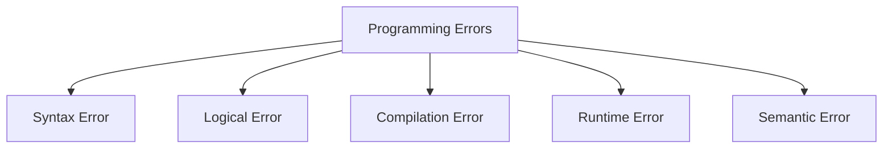

### 10.1 Syntax Error
- Occurs when code **violates the grammar/rules** of the programming language.
- Detected by the compiler/interpreter **before execution**.

```python
# Syntax Error example (missing colon)
if a > b
    print("a is greater")
```

### 10.2 Logical Error
- Code runs successfully (no crash) but produces **incorrect/unexpected output**.
- Hardest to detect since there's no error message — the logic itself is flawed.

```python
# Logical Error example: wrong operator used
# Intention: find average of two numbers
avg = a + b / 2   # Wrong! Should be (a + b) / 2 due to operator precedence
```

### 10.3 Compilation Error
- Occurs during the **compilation phase**, when the compiler cannot translate source code into machine code.
- Includes syntax errors, type mismatches, undeclared variables, etc.

```c
// Compilation Error example: undeclared variable
int main() {
    x = 5;   // Error: 'x' was not declared
    return 0;
}
```

### 10.4 Runtime Error
- Occurs **while the program is executing**, even though it compiled successfully.
- Common causes: division by zero, accessing invalid memory, null pointer dereference.

```python
# Runtime Error example
a = 10
b = 0
print(a / b)   # ZeroDivisionError at runtime
```

### 10.5 Semantic Error
- Code is syntactically correct, but the **meaning/intent** doesn't match what's needed — a subtype often grouped with logical errors.

```python
# Semantic Error example
# Intention: compare two strings
if "5" == 5:   # Always False - comparing string to integer
    print("Equal")
```

**Summary Table:**

| Error Type | When Detected | Example Cause | Program Runs? |
|---|---|---|---|
| Syntax Error | Before execution (compile/parse time) | Missing bracket, colon, semicolon | ❌ No |
| Compilation Error | During compilation | Undeclared variable, type mismatch | ❌ No |
| Runtime Error | During execution | Divide by zero, invalid memory access | ⚠️ Starts, then crashes |
| Logical Error | No detection — wrong output | Wrong formula/condition | ✅ Yes (wrong result) |
| Semantic Error | No detection — wrong meaning | Comparing incompatible types | ✅ Yes (unintended behavior) |

---

## 11. Representation of a Problem & Solution

Before writing any code, a problem must be clearly **understood and represented** in a structured way. This is the foundation of computational thinking.

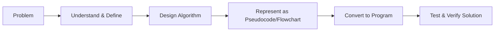

**Steps in problem representation:**

1. **Problem Analysis** — Understand what is being asked, identify inputs and expected outputs.
2. **Algorithm Design** — Break the problem into a logical sequence of steps.
3. **Representation** — Express the algorithm using pseudocode or flowcharts (language-independent).
4. **Implementation** — Convert the representation into actual code (a program).
5. **Testing/Verification** — Run and check if the output matches expectations for all cases.

> 🎯 The same problem can have multiple solutions (algorithms), and choosing the **most efficient** one is a core skill in computer science.

---

## 12. What is an Algorithm?

> **Definition:** An algorithm is a finite, well-defined, step-by-step sequence of instructions designed to solve a specific problem or perform a specific task.

**Key idea:** An algorithm is **language-independent** — it describes *what* to do, not *how* to code it in a specific language.

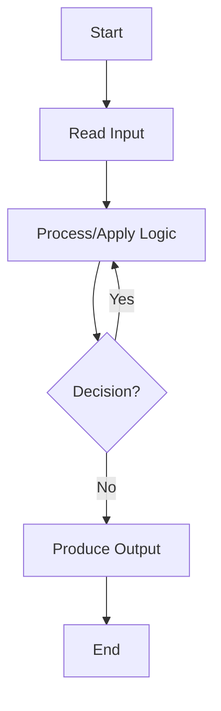

### Generic steps to design an algorithm:

1. **Start** — define the entry point.
2. **Take Input** — identify what data is required.
3. **Define Variables** — declare storage for data.
4. **Process** — apply logic/operations/formulas step by step.
5. **Decision Making** — use conditions to control flow (if needed).
6. **Repeat** — use loops for repetitive tasks (if needed).
7. **Output** — display/return the result.
8. **Stop/End** — terminate the algorithm.

---

## 13. Algorithm Examples — Variable Swapping

Swapping means exchanging the values of two variables. Let's look at **two classic approaches**.

### 13.1 Swapping WITH a Third (Temporary) Variable

**Algorithm:**
```
Step 1: Start
Step 2: Read values of A and B
Step 3: temp ← A
Step 4: A ← B
Step 5: B ← temp
Step 6: Display A and B
Step 7: Stop
```

**Code (Python):**
```python
A = 5
B = 10

temp = A     # temp = 5
A = B        # A = 10
B = temp     # B = 5

print("A =", A, " B =", B)   # Output: A = 10  B = 5
```

**Flowchart:**
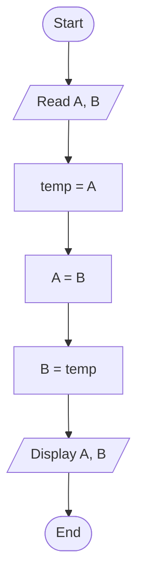

| Step | A | B | temp |
|---|---|---|---|
| Initial | 5 | 10 | — |
| temp = A | 5 | 10 | 5 |
| A = B | 10 | 10 | 5 |
| B = temp | 10 | 5 | 5 |

---

### 13.2 Swapping WITHOUT a Third Variable (Arithmetic Method)

**Algorithm:**
```
Step 1: Start
Step 2: Read values of A and B
Step 3: A ← A + B
Step 4: B ← A - B
Step 5: A ← A - B
Step 6: Display A and B
Step 7: Stop
```

**Code (Python):**
```python
A = 5
B = 10

A = A + B   # A = 15
B = A - B   # B = 15 - 10 = 5
A = A - B   # A = 15 - 5 = 10

print("A =", A, " B =", B)   # Output: A = 10  B = 5
```

> ⚡ **Pythonic bonus:** Python allows direct tuple swapping: `A, B = B, A` — but this uses an implicit temporary tuple internally, so conceptually it's still the "third variable" idea, just hidden by the language.

**Flowchart:**
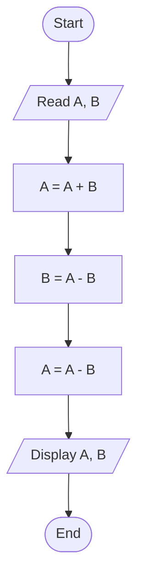

| Step | A | B |
|---|---|---|
| Initial | 5 | 10 |
| A = A + B | 15 | 10 |
| B = A - B | 15 | 5 |
| A = A - B | 10 | 5 |

**Comparison:**

| Method | Extra Memory | Risk | Readability |
|---|---|---|---|
| With temp variable | Uses 1 extra variable | None (safe for all data types) | Very clear, beginner-friendly |
| Without temp variable | No extra memory | Can cause **overflow** for very large numbers | Slightly less intuitive |

---

## 14. Time Complexity & Space Complexity

When multiple algorithms solve the same problem, we compare their **efficiency** using complexity analysis.

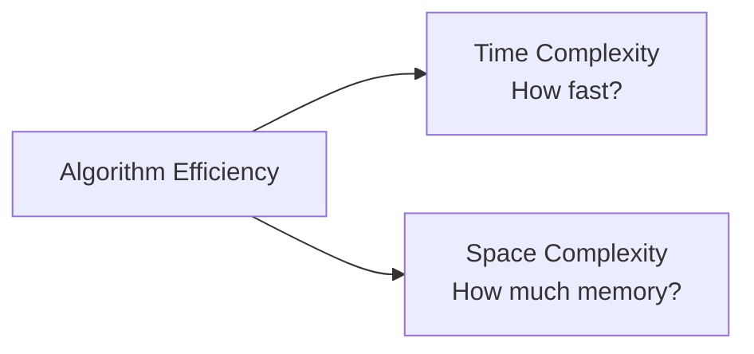

### 14.1 Time Complexity
- Measures how the **running time** of an algorithm grows as the input size (`n`) increases.
- Expressed using **Big-O notation**, which describes the worst-case growth rate.

**Common time complexities (best to worst):**

| Notation | Name | Example |
|---|---|---|
| O(1) | Constant time | Accessing an array element by index |
| O(log n) | Logarithmic time | Binary search |
| O(n) | Linear time | Simple loop through a list |
| O(n log n) | Linearithmic time | Merge sort, Quick sort (avg case) |
| O(n²) | Quadratic time | Nested loops (bubble sort) |
| O(2ⁿ) | Exponential time | Recursive Fibonacci (naive) |
| O(n!) | Factorial time | Brute-force permutations |

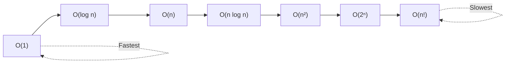

**Example:**
```python
# O(n) - Linear Time: single loop over n elements
for i in range(n):
    print(i)

# O(n²) - Quadratic Time: nested loop
for i in range(n):
    for j in range(n):
        print(i, j)
```

### 14.2 Space Complexity
- Measures the total amount of **memory** an algorithm needs relative to input size `n`.
- Includes space for input, variables, and any auxiliary data structures used.

```python
# O(1) Space - only uses fixed extra variables regardless of n
def sum_array(arr):
    total = 0                # constant extra space
    for x in arr:
        total += x
    return total

# O(n) Space - creates a new list proportional to input size
def double_array(arr):
    result = []               # grows with input size n
    for x in arr:
        result.append(x * 2)
    return result
```

**Comparison Table:**

| Aspect | Time Complexity | Space Complexity |
|---|---|---|
| Measures | Execution speed | Memory usage |
| Notation | Big-O (e.g., O(n)) | Big-O (e.g., O(1), O(n)) |
| Affected by | Loops, recursion, algorithm design | Variables, data structures, recursion stack |
| Goal | Minimize execution time | Minimize memory footprint |

> ⚖️ Often there's a **time-space tradeoff** — you can make an algorithm faster by using more memory (e.g., caching/memoization), or save memory at the cost of speed.

---

## 15. Properties of an Algorithm

Every valid algorithm must satisfy these five essential properties:

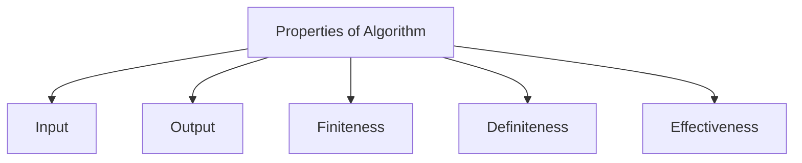

| Property | Meaning | Example |
|---|---|---|
| **Input** | An algorithm must take **zero or more** well-defined inputs | Reading two numbers A and B to add them |
| **Output** | Must produce **at least one** well-defined output/result | Displaying the sum of A and B |
| **Finiteness** | Must terminate after a **finite number of steps** — cannot run forever | A loop that runs `n` times, not infinitely |
| **Definiteness** | Every step must be **precise, clear, and unambiguous** — no vague instructions | "Add 5 to X" is definite; "Add a small number to X" is not |
| **Effectiveness** | Every operation must be **basic enough** to be carried out, in principle, exactly and in finite time | Basic arithmetic operations (+, −, ×, ÷) are effective; "guess the answer" is not |

**Detailed example — Algorithm to find the largest of two numbers:**

```
Step 1: Start                                    → (Finiteness begins)
Step 2: Read A, B                                 → (Input)
Step 3: If A > B then
             Largest ← A
         Else
             Largest ← B                          → (Definiteness - clear condition)
Step 4: Display Largest                            → (Output)
Step 5: Stop                                       → (Finiteness ends)
```
- **Input:** A, B ✅
- **Output:** Largest ✅
- **Finiteness:** Only 5 steps, always ends ✅
- **Definiteness:** The comparison `A > B` is unambiguous ✅
- **Effectiveness:** Comparison and assignment are basic, executable operations ✅

---

## 16. Pseudocode

**Pseudocode** is an informal, language-independent way of describing an algorithm using structured plain-English-like statements, without worrying about programming language syntax.

**Why use pseudocode?**
- Focuses on **logic**, not syntax.
- Easy for anyone (even non-programmers) to understand.
- Acts as a bridge between the algorithm and actual code.

**Common pseudocode keywords:** `START`, `STOP`, `INPUT`, `OUTPUT`, `IF...ELSE`, `WHILE`, `FOR`, `READ`, `DISPLAY`, `SET`

**Example — Pseudocode to check if a number is even or odd:**

```
START
    INPUT number
    IF number MOD 2 == 0 THEN
        DISPLAY "Even"
    ELSE
        DISPLAY "Odd"
    END IF
STOP
```

**Example — Pseudocode to find the sum of first N natural numbers:**

```
START
    INPUT N
    SET sum = 0
    SET i = 1
    WHILE i <= N DO
        sum = sum + i
        i = i + 1
    END WHILE
    DISPLAY sum
STOP
```

> 📝 Pseudocode is **not tied to any specific programming language syntax** — the same pseudocode can later become Python, C++, Java, etc.

---

## 17. Flowcharts

A **flowchart** is a graphical/visual representation of an algorithm using standardized symbols connected by arrows to show the flow of control.

### 17.1 Standard Flowchart Symbols

| Symbol | Shape | Meaning |
|---|---|---|
| Oval | Rounded/Oval | Start / End (Terminator) |
| Parallelogram | Slanted rectangle | Input / Output |
| Rectangle | Rectangle | Process / Calculation |
| Diamond | Rhombus | Decision (Yes/No, True/False) |
| Arrow | Line with arrowhead | Flow direction / Connector |

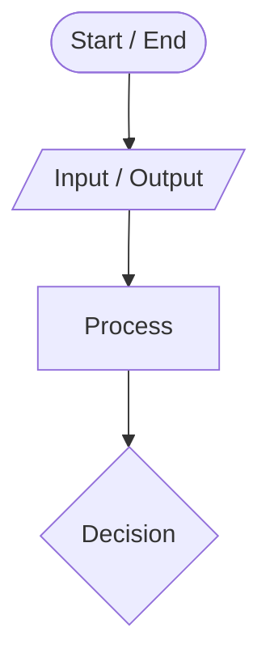

### 17.2 Flowchart Example — Check Even or Odd

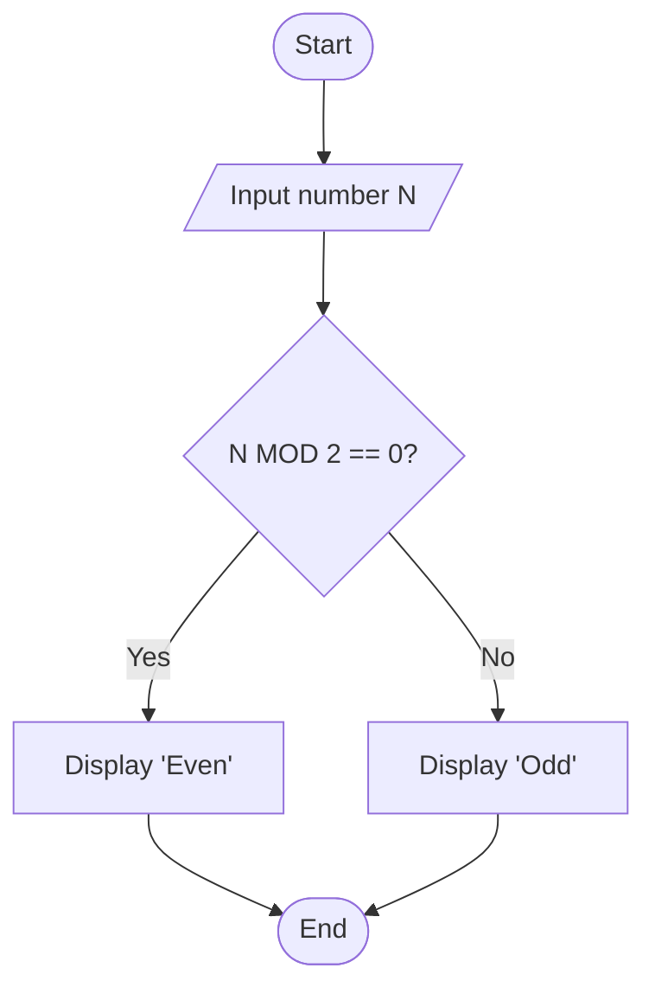

### 17.3 Flowchart Example — Sum of First N Natural Numbers

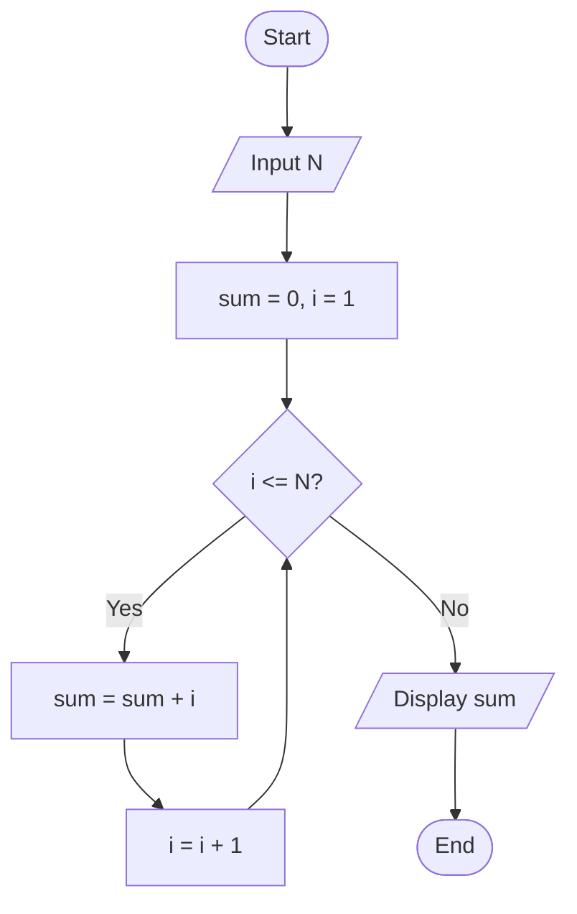

**Pseudocode vs Flowchart:**

| Aspect | Pseudocode | Flowchart |
|---|---|---|
| Format | Text-based, structured English | Graphical, uses symbols/shapes |
| Best for | Detailed logic, complex algorithms | Quick visual overview, presentations |
| Readability | Requires reading line by line | Instantly shows flow/branching visually |
| Conversion to code | Easier, closer to code structure | Needs translation into logic first |

---

## 18. Program vs Algorithm — Final Summary

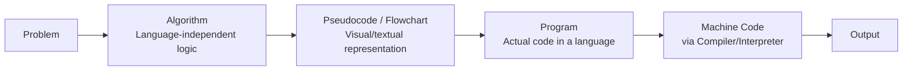

| Aspect | Algorithm | Program |
|---|---|---|
| Definition | Step-by-step logical solution to a problem | Implementation of an algorithm in a programming language |
| Language dependency | Independent of any programming language | Written in a specific language (Python, C++, Java, etc.) |
| Format | Pseudocode / Flowchart / Plain steps | Source code |
| Executability | Cannot be directly executed by a computer | Can be compiled/interpreted and executed |
| Focus | *What* to do | *How* to do it in code |

### Quick Recap Table — Whole Journey

| Stage | Concept |
|---|---|
| 1 | Understand the problem |
| 2 | Design the algorithm (finite, definite, effective steps) |
| 3 | Represent it via pseudocode / flowchart |
| 4 | Write the program in a high-level language |
| 5 | Translate via compiler/interpreter into machine code |
| 6 | CPU executes via fetch-decode-execute cycle using RAM, ALU, CU |
| 7 | Output is produced and optionally stored via HDD/SSD |

---

## 📌 Key Takeaways

- A **computer system** = Hardware + Software working together via the Input-Process-Output cycle.
- **RAM** is fast & volatile (working memory); **HDD/SSD** are slower & non-volatile (permanent storage).
- The **CPU** (via CU + ALU + Registers) is the brain that executes instructions.
- Programming languages range from **high-level** (human-friendly) to **machine-level** (binary), translated via **compilers**, **interpreters**, or **assemblers**.
- **Errors** can be syntax, compilation, runtime, logical, or semantic — each caught at a different stage.
- An **algorithm** is a finite, definite, effective, language-independent problem-solving procedure with defined input/output.
- **Time complexity** and **space complexity** measure an algorithm's efficiency using Big-O notation.
- **Pseudocode** and **flowcharts** are two ways to represent algorithms before actual coding.

---

*📂 Notes prepared for GitHub reference — feel free to fork, star, and extend with more examples!*
