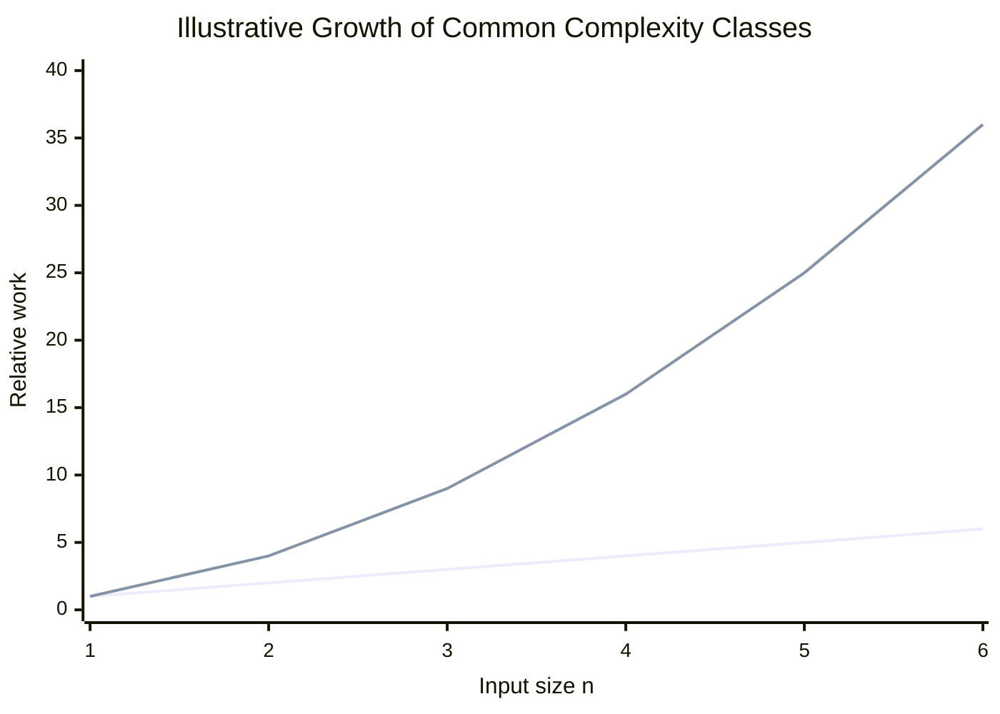
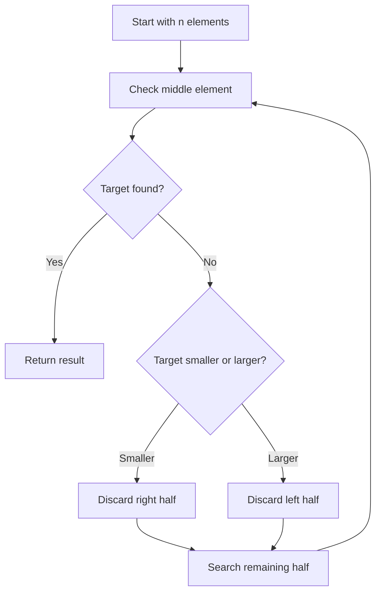
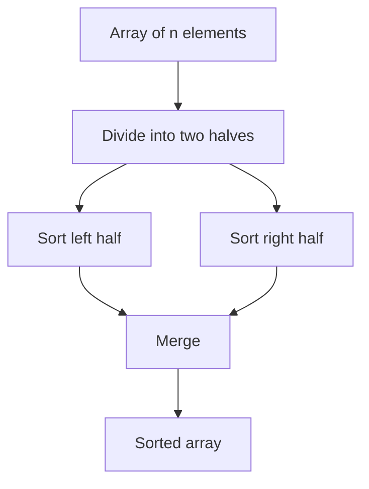
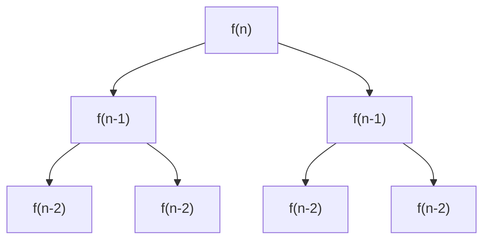
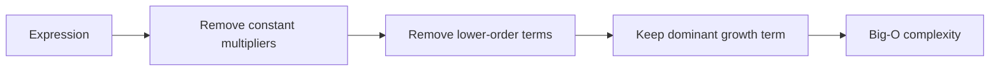
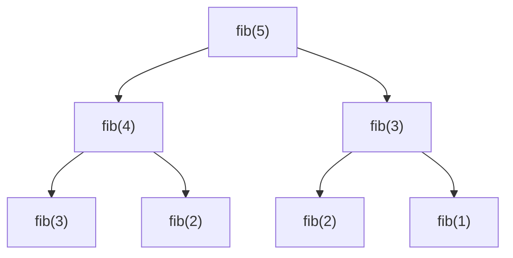
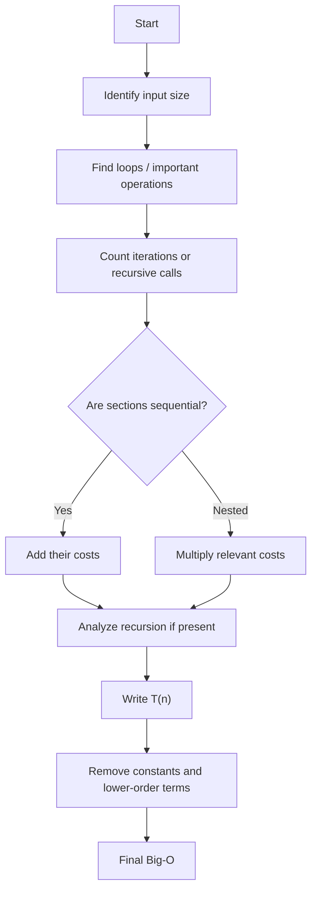
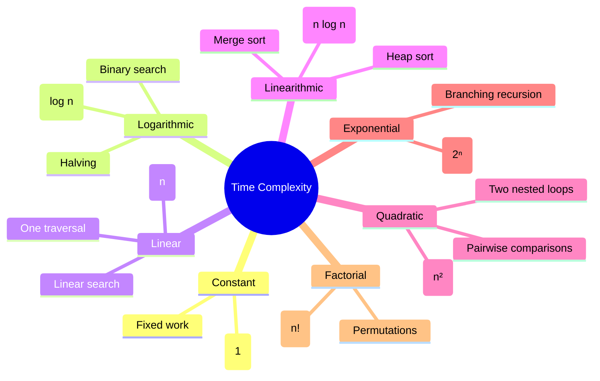

# Time Complexity — Detailed Notes

> A structured guide to understanding, analyzing, and calculating time complexity, with tables, Mermaid diagrams, flowcharts, examples, and quick-reference rules.

---

## 1. What Is Time Complexity?

**Time complexity** describes how the amount of computational work performed by an algorithm grows as the input size grows.

It does **not normally mean the exact number of seconds** a program takes. Instead, it describes the relationship between:

- **n** = size of the input
- **Work performed** = number of important operations

For example, if we search an array one element at a time, an input of `n` elements may require up to `n` checks.

Therefore:

\[
T(n) \approx n
\]

and the time complexity is:

\[
\boxed{O(n)}
\]

---

## 2. Why Do We Need Time Complexity?

Consider two algorithms.

### Algorithm A

```python
for i in range(n):
    print(i)
```

The loop executes `n` times.

### Algorithm B

```python
for i in range(n):
    for j in range(n):
        print(i, j)
```

The inner operation executes:

\[
n \times n = n^2
\]

times.

| Input `n` | Algorithm A | Algorithm B |
|---:|---:|---:|
| 10 | 10 | 100 |
| 100 | 100 | 10,000 |
| 1,000 | 1,000 | 1,000,000 |
| 10,000 | 10,000 | 100,000,000 |

Therefore:

- Algorithm A → **O(n)**
- Algorithm B → **O(n²)**

### Growth intuition



> The chart is illustrative rather than a runtime benchmark.

---

# 3. Big O Notation

The most common notation for time complexity is **Big O**.

Common complexity classes:

| Complexity | Name | General intuition |
|---|---|---|
| `O(1)` | Constant | Work stays approximately constant |
| `O(log n)` | Logarithmic | Input is repeatedly reduced |
| `O(n)` | Linear | Work grows proportionally to input |
| `O(n log n)` | Linearithmic | Common in efficient sorting |
| `O(n²)` | Quadratic | Often caused by nested loops |
| `O(n³)` | Cubic | Often caused by three nested loops |
| `O(2ⁿ)` | Exponential | Work roughly doubles with each added input item |
| `O(n!)` | Factorial | Work explores permutations/orderings |

### Typical growth ordering

```text
Better scalability
       ↓
O(1)
O(log n)
O(n)
O(n log n)
O(n²)
O(n³)
O(2ⁿ)
O(n!)
       ↓
Worse scalability
```

This is a useful asymptotic comparison, not a universal statement about actual runtime for every input size and implementation.

---

# 4. The Main Complexity Classes

## 4.1 O(1) — Constant Time

An algorithm is **O(1)** when the amount of work does not grow with the input size.

Example:

```python
numbers = [10, 20, 30, 40, 50]
print(numbers[0])
```

Accessing an array element by index is generally constant time.

Whether the array has 10 or 1,000,000 elements, the indexed access itself remains approximately one lookup.

\[
T(n)=c
\]

Therefore:

\[
\boxed{O(1)}
\]

### Example

```python
def first_element(arr):
    return arr[0]
```

**Time:** `O(1)`

---

## 4.2 O(n) — Linear Time

A loop that processes every element once is typically linear.

```python
def print_elements(arr):
    for x in arr:
        print(x)
```

If the array contains `n` elements:

\[
T(n) \approx n
\]

Therefore:

\[
\boxed{O(n)}
\]

### Linear search

```python
def search(arr, target):
    for x in arr:
        if x == target:
            return True
    return False
```

Worst case: every element is examined.

**Worst-case time:** `O(n)`

---

## 4.3 O(n²) — Quadratic Time

Nested loops often produce quadratic complexity.

```python
for i in range(n):
    for j in range(n):
        print(i, j)
```

The outer loop runs `n` times.

For every outer iteration, the inner loop runs `n` times.

Therefore:

\[
n \times n=n^2
\]

So:

\[
\boxed{O(n^2)}
\]

### Example growth

| `n` | `n²` |
|---:|---:|
| 10 | 100 |
| 100 | 10,000 |
| 1,000 | 1,000,000 |
| 10,000 | 100,000,000 |

---

## 4.4 O(log n) — Logarithmic Time

Logarithmic complexity often appears when the input is repeatedly divided by a constant factor.

The classic example is **binary search**.

Suppose the data is sorted:

```text
[1, 3, 5, 7, 9, 11, 13, 15]
```

Instead of checking every item, binary search examines the middle and eliminates roughly half the remaining search space.



The input sizes look approximately like:

\[
n,\frac n2,\frac n4,\frac n8,\ldots,1
\]

The number of divisions is approximately:

\[
\log_2 n
\]

Therefore:

\[
\boxed{O(\log n)}
\]

For about one billion elements:

\[
\log_2(1,000,000,000)\approx30
\]

So binary search can reduce the search space to a tiny number of steps compared with checking every element.

---

## 4.5 O(n log n) — Linearithmic Time

Many efficient sorting algorithms have `O(n log n)` complexity in their relevant cases.

Examples include:

- Merge sort
- Heap sort
- Quicksort on average

For merge sort, the input is repeatedly divided into smaller pieces.

There are approximately:

\[
\log n
\]

levels.

At each level, approximately:

\[
n
\]

elements are processed.

Therefore:

\[
n\log n
\]

and:

\[
\boxed{O(n\log n)}
\]

### Merge-sort structure



---

## 4.6 O(2ⁿ) — Exponential Time

Consider:

```python
def f(n):
    if n <= 1:
        return

    f(n - 1)
    f(n - 1)
```

Each call creates approximately two more calls.

The recursion tree grows rapidly:



A common upper-bound description is:

\[
\boxed{O(2^n)}
\]

Approximate growth:

| `n` | `2ⁿ` |
|---:|---:|
| 10 | 1,024 |
| 20 | 1,048,576 |
| 30 | 1,073,741,824 |
| 40 | 1,099,511,627,776 |

---

## 4.7 O(n!) — Factorial Time

Generating every permutation of `n` elements can require:

\[
n!
\]

possibilities.

For example, three elements have:

\[
3!=3\times2\times1=6
\]

permutations.

For larger values:

| `n` | `n!` |
|---:|---:|
| 5 | 120 |
| 10 | 3,628,800 |
| 20 | ≈ 2.43 × 10¹⁸ |

Factorial complexity becomes extremely large very quickly.

---

# 5. Why Constants and Lower-Order Terms Are Ignored

Suppose:

\[
T(n)=3n^2+5n+20
\]

For very large `n`, the `n²` term dominates.

Therefore:

\[
\boxed{O(n^2)}
\]

Similarly:

\[
5n+100 \rightarrow O(n)
\]

and:

\[
10n^2+3n+50 \rightarrow O(n^2)
\]

### Simplification rule



### Examples

| Exact-style expression | Big O |
|---|---|
| `5` | `O(1)` |
| `5n + 10` | `O(n)` |
| `3n² + 5n + 2` | `O(n²)` |
| `7n³ + n² + n` | `O(n³)` |
| `n log n + n` | `O(n log n)` |

> Constants can matter in actual performance. Big O is about asymptotic growth.

---

# 6. Sequential Loops vs Nested Loops

This is one of the most important rules for beginner complexity analysis.

## Sequential loops

```python
for i in range(n):
    print(i)

for j in range(n):
    print(j)
```

First loop:

\[
O(n)
\]

Second loop:

\[
O(n)
\]

Total:

\[
O(n)+O(n)=O(2n)=\boxed{O(n)}
\]

## Nested loops

```python
for i in range(n):
    for j in range(n):
        print(i, j)
```

Total:

\[
n\times n=n^2
\]

Therefore:

\[
\boxed{O(n^2)}
\]

### Rule of thumb

```text
Sequential sections → ADD their costs
Nested dependent loops → MULTIPLY their costs
```

---

# 7. A Loop Does Not Automatically Mean O(n)

Consider:

```python
i = 1

while i < n:
    i *= 2
```

The values of `i` are approximately:

```text
1 → 2 → 4 → 8 → 16 → 32 → ...
```

The value doubles each iteration.

The number of iterations is approximately:

\[
\log_2 n
\]

Therefore:

\[
\boxed{O(\log n)}
\]

### Important pattern

If a loop variable is repeatedly:

- multiplied by 2 → often `O(log n)`
- divided by 2 → often `O(log n)`
- increased by 1 → often `O(n)`

---

# 8. Multiple Input Variables

Suppose:

```python
for x in arr1:
    print(x)

for y in arr2:
    print(y)
```

If:

```text
len(arr1) = n
len(arr2) = m
```

then:

\[
O(n)+O(m)=\boxed{O(n+m)}
\]

Now consider:

```python
for x in arr1:
    for y in arr2:
        print(x, y)
```

The number of operations is:

\[
n\times m
\]

Therefore:

\[
\boxed{O(nm)}
\]

Do not automatically replace `m` with `n` when the two input sizes can vary independently.

---

# 9. Best Case, Average Case, and Worst Case

An algorithm can perform differently depending on the input.

Consider linear search:

```python
def search(arr, target):
    for x in arr:
        if x == target:
            return True
    return False
```

Suppose:

```text
[10, 20, 30, 40, 50]
```

Searching for `10` finds the target immediately.

### Best case

\[
\boxed{O(1)}
\]

Searching for `50` or an absent value may require checking every element.

### Worst case

\[
\boxed{O(n)}
\]

The average case depends on assumptions about the input distribution.

---

# 10. Big O, Big Ω, and Big Θ

## Big O — O(...)

Describes an **asymptotic upper bound**.

Informally:

> The growth does not exceed this bound up to constant factors for sufficiently large inputs.

## Big Omega — Ω(...)

Describes an **asymptotic lower bound**.

Informally:

> The growth is at least this rate up to constant factors for sufficiently large inputs.

## Big Theta — Θ(...)

Describes a **tight asymptotic bound**.

For example:

\[
T(n)=5n+20
\]

has:

\[
\boxed{\Theta(n)}
\]

because its growth is both upper- and lower-bounded by constant multiples of `n`.

### Comparison

| Notation | Meaning |
|---|---|
| `O(f(n))` | Upper bound |
| `Ω(f(n))` | Lower bound |
| `Θ(f(n))` | Tight bound |

---

# 11. Recursive Algorithms

Recursion requires looking at:

1. How many recursive calls are made.
2. How the input size changes.
3. The amount of non-recursive work per call.

## Example: countdown

```python
def countdown(n):
    if n == 0:
        return

    print(n)
    countdown(n - 1)
```

The input decreases by 1 each time:

```text
n → n-1 → n-2 → ... → 0
```

Approximately `n` calls occur.

Therefore:

\[
\boxed{O(n)}
\]

## Example: repeated halving

```python
def halve(n):
    if n <= 1:
        return

    halve(n // 2)
```

The input becomes:

```text
n → n/2 → n/4 → n/8 → ...
```

Therefore:

\[
\boxed{O(\log n)}
\]

---

# 12. Naive Fibonacci

Consider:

```python
def fib(n):
    if n <= 1:
        return n

    return fib(n - 1) + fib(n - 2)
```

The function repeatedly generates overlapping recursive calls.

Conceptually:



The number of calls grows exponentially.

A common simple bound is:

\[
\boxed{O(2^n)}
\]

A tighter analysis gives approximately exponential growth based on the golden ratio.

Memoization/dynamic programming can reduce the repeated work dramatically.

---

# 13. Time Complexity vs Space Complexity

These are different concepts.

### Time complexity

> How does computational work grow?

### Space complexity

> How does memory usage grow?

Example:

```python
def copy_array(arr):
    result = []

    for x in arr:
        result.append(x)

    return result
```

The loop processes `n` elements:

\[
\boxed{\text{Time}=O(n)}
\]

The new list stores `n` elements:

\[
\boxed{\text{Additional space}=O(n)}
\]

---

# 14. Common Data-Structure Operations

Approximate typical complexities:

| Operation | Typical time complexity |
|---|---:|
| Array access by index | `O(1)` |
| Array linear search | `O(n)` |
| Binary search on sorted array | `O(log n)` |
| Hash-table lookup | `O(1)` average |
| Dynamic-array append | `O(1)` amortized |
| Insert at beginning of array | `O(n)` |
| Traverse linked list | `O(n)` |
| Merge sort | `O(n log n)` |
| Heap sort | `O(n log n)` |
| Bubble sort | `O(n²)` |
| Selection sort | `O(n²)` |
| Insertion sort | `O(n²)` worst case |

> Exact complexities can depend on implementation, data structure, and whether average, amortized, or worst-case behavior is being discussed.

---

# 15. Step-by-Step Method to Calculate Time Complexity

Use this procedure when given a code snippet.



## Example

```python
def example(n):
    for i in range(n):
        print(i)

    for i in range(n):
        for j in range(n):
            print(i, j)
```

### Step 1 — First section

```python
for i in range(n):
```

Complexity:

\[
O(n)
\]

### Step 2 — Second section

```python
for i in range(n):
    for j in range(n):
```

Complexity:

\[
O(n^2)
\]

### Step 3 — Add them

\[
O(n)+O(n^2)
\]

### Step 4 — Keep the dominant term

\[
\boxed{O(n^2)}
\]

---

# 16. Quick Recognition Rules

| Code pattern | Usually suggests |
|---|---:|
| Single fixed number of operations | `O(1)` |
| One loop from `0` to `n` | `O(n)` |
| Two independent loops of `n` | `O(n)` |
| Loop inside loop, both up to `n` | `O(n²)` |
| Three nested `n` loops | `O(n³)` |
| Repeatedly divide input by 2 | `O(log n)` |
| `n` work at each of `log n` levels | `O(n log n)` |
| Two recursive calls on `n-1` | Often exponential |
| Generate all permutations | `O(n!)` |
| Separate arrays of sizes `n` and `m` | Use `n` and `m` separately |

---

# 17. Common Mistakes

## Mistake 1: Thinking every loop is O(n)

```python
i = 1
while i < n:
    i *= 2
```

This is generally:

\[
O(\log n)
\]

not `O(n)`.

---

## Mistake 2: Adding nested loops

```python
for i in range(n):
    for j in range(n):
        ...
```

Do not calculate:

\[
O(n+n)
\]

The loops are nested, so:

\[
O(n\times n)=O(n^2)
\]

---

## Mistake 3: Multiplying sequential loops

```python
for i in range(n):
    ...

for j in range(n):
    ...
```

These are sequential, so:

\[
O(n)+O(n)=O(n)
\]

not `O(n²)`.

---

## Mistake 4: Keeping unnecessary constants

\[
O(5n)
\]

is normally simplified to:

\[
\boxed{O(n)}
\]

---

## Mistake 5: Keeping lower-order terms

\[
O(n^2+n+1)
\]

becomes:

\[
\boxed{O(n^2)}
\]

---

## Mistake 6: Ignoring independent input sizes

If one array has size `n` and another has size `m`:

```python
for x in arr1:
    ...

for y in arr2:
    ...
```

the complexity is:

\[
O(n+m)
\]

not necessarily `O(n)`.

---

# 18. Input Doubling Intuition

A powerful way to understand complexity is to ask:

> What happens when the input size doubles?

| Complexity | Approximate change when `n → 2n` |
|---|---:|
| `O(1)` | Same order of work |
| `O(log n)` | Slight increase |
| `O(n)` | ≈ 2× |
| `O(n log n)` | A little more than 2× |
| `O(n²)` | ≈ 4× |
| `O(n³)` | ≈ 8× |
| `O(2ⁿ)` | Roughly squares the previous exponential factor |

For polynomial complexities:

\[
(2n)^k=2^k n^k
\]

So:

- `O(n)` → `2×`
- `O(n²)` → `4×`
- `O(n³)` → `8×`

This is one reason higher-order polynomial algorithms scale poorly.

---

# 19. Complexity Cheat Sheet

```text
O(1)
    Constant
    ↓
O(log n)
    Logarithmic
    ↓
O(n)
    Linear
    ↓
O(n log n)
    Linearithmic
    ↓
O(n²)
    Quadratic
    ↓
O(n³)
    Cubic
    ↓
O(2ⁿ)
    Exponential
    ↓
O(n!)
    Factorial
```

### Memory trick

```text
Constant      → fixed work
Logarithmic   → repeatedly divide
Linear        → visit each item
n log n       → divide + process all
Quadratic     → pairwise/nested
Exponential   → branching recursion
Factorial     → permutations
```

---

# 20. Worked Examples

## Example 1

```python
x = 10
print(x)
```

Only a fixed amount of work.

\[
\boxed{O(1)}
\]

---

## Example 2

```python
for i in range(n):
    print(i)
```

Runs `n` times.

\[
\boxed{O(n)}
\]

---

## Example 3

```python
for i in range(n):
    for j in range(n):
        print(i, j)
```

Runs:

\[
n^2
\]

times.

\[
\boxed{O(n^2)}
\]

---

## Example 4

```python
i = 1
while i < n:
    i *= 2
```

Number of iterations:

\[
\log_2 n
\]

Therefore:

\[
\boxed{O(\log n)}
\]

---

## Example 5

```python
for i in range(n):
    print(i)

i = 1
while i < n:
    i *= 2
```

First section:

\[
O(n)
\]

Second section:

\[
O(\log n)
\]

Together:

\[
O(n+\log n)
\]

Since `n` grows faster:

\[
\boxed{O(n)}
\]

---

## Example 6

```python
for i in range(n):
    for j in range(n):
        print(i, j)

for k in range(n):
    print(k)
```

First part:

\[
O(n^2)
\]

Second part:

\[
O(n)
\]

Total:

\[
O(n^2+n)
\]

Final:

\[
\boxed{O(n^2)}
\]

---

# 21. The Core Intuition

Instead of asking:

> "How many seconds will this program take?"

ask:

> **"How does the amount of work grow when the input becomes larger?"**

For example:

```text
Input doubles:

O(1)       → approximately unchanged
O(log n)   → increases slightly
O(n)       → approximately 2×
O(n log n) → slightly more than 2×
O(n²)      → approximately 4×
O(n³)      → approximately 8×
O(2ⁿ)      → increases extremely rapidly
```

That idea—**growth with respect to input size**—is the heart of time-complexity analysis.

---

# 22. Exam-Oriented Summary

### Must remember

1. **`O(1)`** → constant work.
2. **`O(log n)`** → repeatedly divide the input.
3. **`O(n)`** → process all elements once.
4. **`O(n log n)`** → common efficient sorting complexity.
5. **`O(n²)`** → commonly two nested loops.
6. **`O(n³)`** → commonly three nested loops.
7. **`O(2ⁿ)`** → branching/exponential recursion.
8. **`O(n!)`** → permutations.
9. Sequential work → **add**.
10. Nested work → usually **multiply**.
11. Drop constant factors.
12. Drop lower-order terms.
13. Always check whether variables represent independent input sizes.
14. For recursion, analyze the recursion tree or recurrence.
15. Distinguish **time complexity** from **space complexity**.

---

# 23. One-Page Revision Table

| Pattern | Complexity |
|---|---:|
| Fixed number of operations | **O(1)** |
| One full traversal | **O(n)** |
| Two independent traversals | **O(n)** |
| Nested two-level traversal | **O(n²)** |
| Nested three-level traversal | **O(n³)** |
| Repeated halving | **O(log n)** |
| Divide + process all elements | **O(n log n)** |
| Two recursive branches | Often **O(2ⁿ)** |
| All permutations | **O(n!)** |

---

## Final Mental Model



### Golden rule

> **Time complexity is about the growth of computational work as input size grows—not simply the number of lines of code.**
