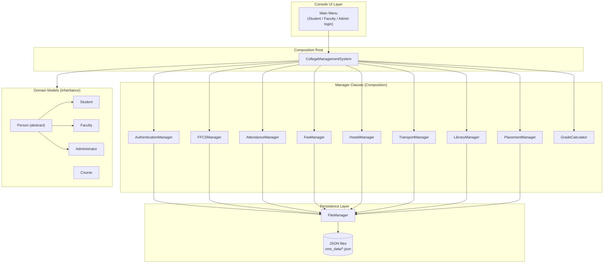
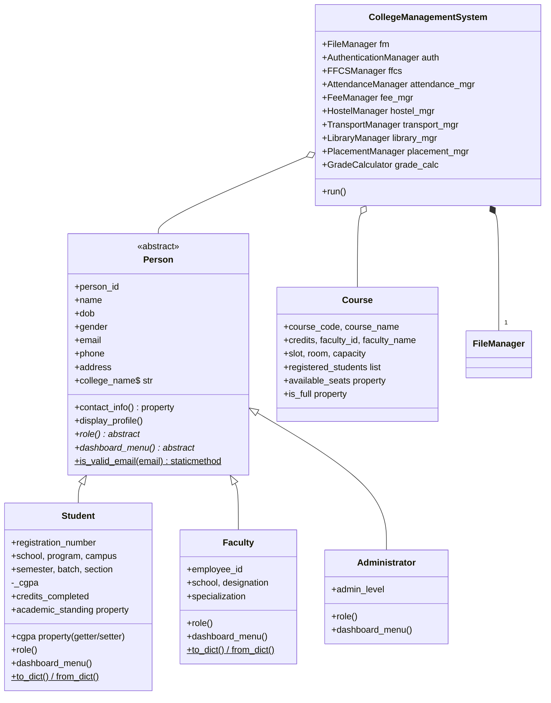
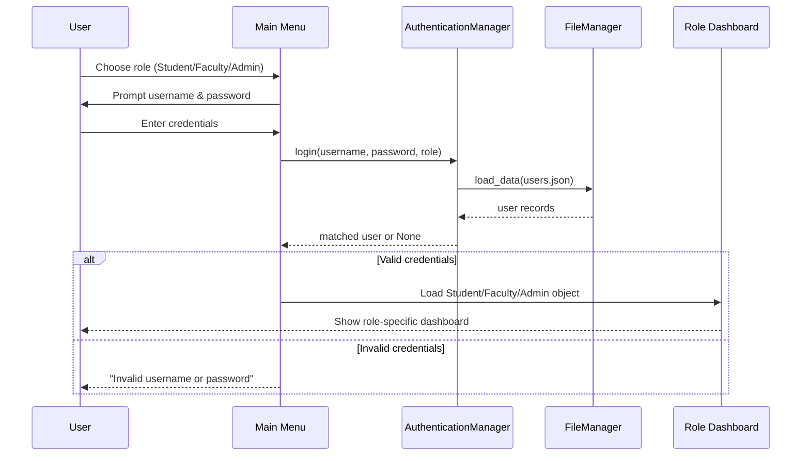
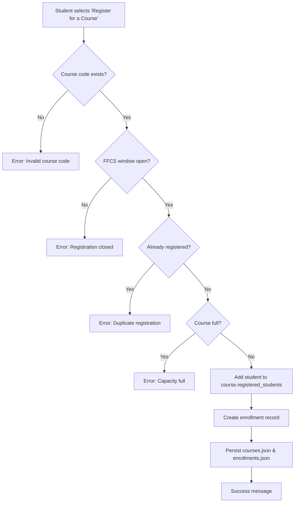
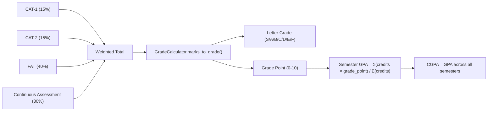
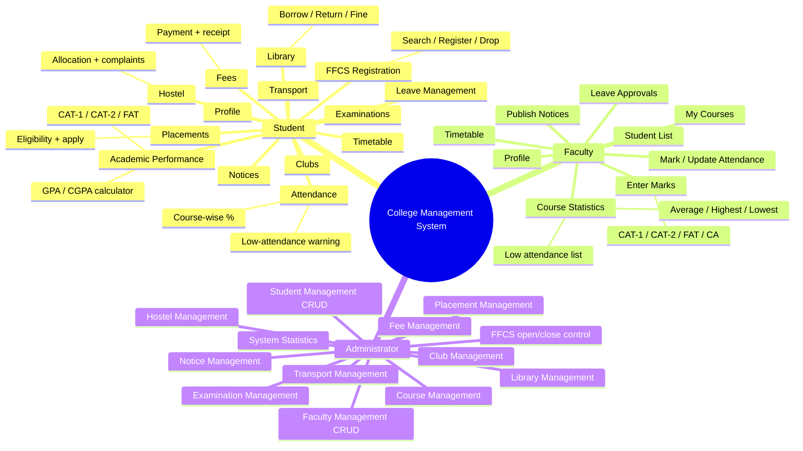

# 🎓 VIT-Style College Management System

A single-file, terminal-based **College Management System** written in pure
Python (standard library only), inspired by the general academic workflow of
a large Indian private engineering university (FFCS registration, CAT-1 /
CAT-2 / FAT exams, CGPA, hostel/transport/library, placements, etc.).

> ⚠️ **Disclaimer**: This is an original, independently-written educational
> project. It is **not** affiliated with, endorsed by, or a copy of any real
> university's actual software, and contains no confidential or internal
> data — only generic academic concepts (FFCS, CAT, FAT, CGPA...) that are
> commonly used across many Indian universities.

---

## 📌 Overview

| | |
|---|---|
| **Language** | Python 3.8+ (standard library only — no external packages) |
| **Interface** | Terminal / console menus |
| **Storage** | JSON files (auto-created on first run) |
| **Lines of code** | ~1,600 lines of functional Python |
| **Roles** | Student, Faculty, Administrator |
| **Data persistence** | `cms_data/` folder, one JSON file per entity |

---

## 🚀 How to Run

```bash
python college_management.py
```

On the **very first run**, the system automatically detects that no data
exists yet and seeds itself with realistic demo data (10 students, 5
faculty, 10 courses, 15 books, 5 hostel rooms, 3 bus routes, 5 clubs, 3
placement companies, notices, attendance, and marks) so you can explore
every feature immediately.

All data is stored under a `cms_data/` folder created next to the script.

### Demo Login Credentials

| Role | Username | Password |
|---|---|---|
| Administrator | `admin` | `admin123` |
| Faculty | `faculty01` … `faculty05` | `faculty123` |
| Student | `student01` … `student10` | `student123` |

> 🔐 **Security note**: passwords are stored in plain text inside
> `users.json` purely for this educational demo. A real production system
> must **hash and salt** passwords (e.g. `hashlib.pbkdf2_hmac`, `bcrypt`)
> and never store raw credentials.

---

## 🧭 System Architecture

The whole program lives in one file but is internally organized into
clear layers: **persistence → domain models → managers → the composition
root (`CollegeManagementSystem`) → console UI**.



---

## 🧬 Class Hierarchy (Inheritance & Polymorphism)

`Person` is an **abstract base class** (`ABC`) that defines the contract
every role must follow — `role()` and `dashboard_menu()` are abstract
methods, each overridden differently by the three subclasses
(**polymorphism**). Each subclass also **overrides** `display_profile()`,
calling `super().display_profile()` first and then adding its own fields.



---

## 🔑 Object-Oriented Concepts Demonstrated

| Concept | Where it appears |
|---|---|
| **Abstraction** | `Person(ABC)` with `@abstractmethod role()` and `dashboard_menu()` |
| **Inheritance** | `Student`, `Faculty`, `Administrator` all extend `Person` |
| **Polymorphism / Method Overriding** | Each subclass implements `role()`, `dashboard_menu()`, and overrides `display_profile()` differently |
| **Encapsulation** | `Student._cgpa` is a private-by-convention attribute exposed only through a validated `@property` |
| **Properties (getter/setter)** | `Student.cgpa` (validates 0–10 range), `Student.academic_standing`, `Course.available_seats`, `Person.contact_info` |
| **Class variables** | `Person.college_name`, `Student.required_attendance_default` |
| **Static methods** | `Person.is_valid_email()`, `GradeCalculator.compute_total()` |
| **Class methods** | `Student.from_dict()`, `Faculty.from_dict()` (alternate constructors) |
| **Composition** | `CollegeManagementSystem` *has-a* `FileManager`, `AuthenticationManager`, `FFCSManager`, `AttendanceManager`, `FeeManager`, `HostelManager`, `TransportManager`, `LibraryManager`, `PlacementManager`, `GradeCalculator` |
| **Single Responsibility per class** | Every manager (Fee, Hostel, Library, Transport, Placement, FFCS, Attendance) owns exactly one domain |
| **DRY file handling** | All JSON reads/writes go through one reusable `FileManager` (`load_data`, `save_data`, `add_record`, `update_record`, `delete_record`) |

---

## 🔄 Core Workflows

### Login Flow



### FFCS Course Registration



### Grade & GPA Calculation



**Grading scale used** (configurable inside `GradeCalculator`):

| Marks | Grade | Grade Point |
|---|---|---|
| 90–100 | S | 10 |
| 80–89 | A | 9 |
| 70–79 | B | 8 |
| 60–69 | C | 7 |
| 50–59 | D | 6 |
| 40–49 | E | 5 |
| 0–39 | F | 0 |

---

## 🗂️ Data Model / JSON Files

All files live inside the `cms_data/` folder and are created automatically
the first time they're needed — nothing needs to be set up manually.

| File | Purpose |
|---|---|
| `students.json` | Student profiles, academic info, CGPA |
| `faculty.json` | Faculty profiles and specializations |
| `users.json` | Login credentials mapped to a role + linked person ID |
| `administrators.json` | Administrator profile(s) |
| `courses.json` | Course catalog: code, credits, faculty, slot, capacity, roster |
| `enrollments.json` | Student ↔ Course FFCS registrations |
| `attendance.json` | Per-date, per-course, per-student attendance status |
| `marks.json` | CAT-1 / CAT-2 / FAT / CA marks, computed total & grade |
| `exams.json` | Exam schedule per course |
| `fees.json` | Tuition/hostel/transport/fine/other charges + amount paid |
| `hostel.json` | Hostel rooms, block, type, capacity, occupants |
| `transport.json` | Bus routes, timings, fee, assigned riders |
| `books.json` | Library catalog with total/available copies |
| `library_transactions.json` | Borrow/return records, due dates, fines |
| `leaves.json` | Student leave applications and approval status |
| `clubs.json` | Clubs, members, and their events |
| `placements.json` | Companies, roles, minimum CGPA, package |
| `placement_applications.json` | Student applications to companies |
| `notices.json` | Categorized notices (Academic/Examination/Placement/General) |
| `settings.json` | System-wide configurable settings (see below) |

### Configurable System Settings (`settings.json`)

```json
{
  "required_attendance_percentage": 75.0,
  "ffcs_registration_open": true,
  "current_semester": 5,
  "current_academic_year": "2025-2026"
}
```

The required attendance threshold, for example, is **never hard-coded** —
`AttendanceManager` always reads it from `settings.json`, so an
administrator could change it project-wide by editing one value.

---

## 👤 Role-by-Role Feature Map



---

## 🛡️ Validation & Error Handling

- All numeric input goes through `safe_int_input()` / `safe_float_input()`
  helpers that loop until a valid number in range is given.
- All required text fields go through `non_empty_input()`.
- `FileManager.load_data()` recovers gracefully (re-initializes the file)
  if a JSON file is missing, empty, or corrupted.
- Every "action" method (register course, pay fee, borrow book, allocate
  room…) returns a `(success: bool, message: str)` tuple so the UI layer
  can print a clear `[SUCCESS]` / `[ERROR]` message instead of crashing.
- The whole `main()` function is wrapped in a top-level `try/except` so an
  unexpected error never produces a raw Python traceback for the end user.

---

## 🧩 Extending the System

Because every domain concern is isolated in its own manager class behind
`FileManager`, adding a new feature usually means:

1. Add a new JSON filename to the `FILES` dictionary.
2. Create a small manager class (constructor takes `FileManager`).
3. Wire it into `CollegeManagementSystem.__init__`.
4. Add a menu entry + handler method in the relevant session loop
   (`_student_session`, `_faculty_session`, or `_admin_session`).

---

## ✅ Summary

| Requirement | Status |
|---|---|
| Single `.py` file | ✅ |
| ~1000+ lines of meaningful code | ✅ |
| OOP: inheritance, polymorphism, abstraction, encapsulation, composition, static/class methods, properties | ✅ |
| Console-only, no GUI | ✅ |
| Standard library only | ✅ |
| JSON persistence, auto-created files | ✅ |
| Input validation & exception handling | ✅ |
| Demo data seeded on first run | ✅ |
| Role-based dashboards (Student / Faculty / Admin) | ✅ |
| FFCS, attendance, grading, fees, hostel, transport, library, leave, clubs, placements, notices | ✅ |
